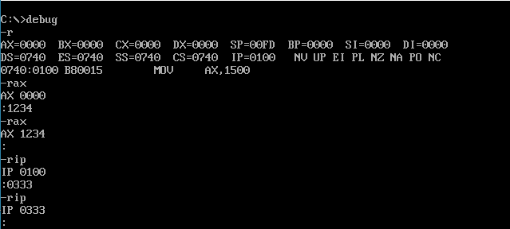
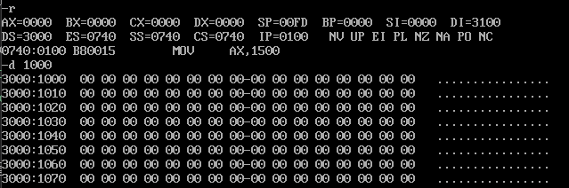
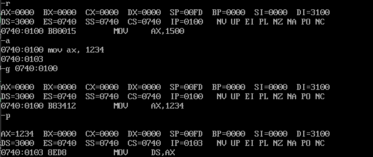

## debug调试简明手册

学习汇编过程中, 常需要观察各寄存器或存储器的状态, 使用[debug](https://github.com/Wistral/simple-masm/blob/master/1-%E5%AE%89%E8%A3%85%E7%8E%AF%E5%A2%83%E4%B8%8E%E9%85%8D%E7%BD%AE/install/masm/debug.exe)就可以很直观地观察变化.

这里简单总结一下debug常用的功能

说明:
- 以下命令选项不分大小写
- debug下默认输入的数是十六进制, 不需要额外加h, 否则会报错

## debug命令

### - **R** 查看寄存器状态(Register)
- 不带参数, 查看所有寄存器状态
- 后面加寄存器, 可以查看修改寄存器内容, 也可以直接回车, 只查看不修改

### - **D** 查看存储器状态(Display)
- 无参数, 默认查看1000:0100开始的一段
- 加*短地址*(偏移地址), 查看ds:*短地址* 开始的一段

- 加*段地址*:*偏移地址*, 查看*段地址*:*偏移地址*开始的一段
### - **E** 修改存储器的内容(Edit)
### - **U** 
### - **G** 运行指令(Go)
- *段地址*:*偏移地址* 从*段地址*:*偏移地址*开始执行
### - **T** 单步运行(Trace)
### - **P** 单步运行(Pause)
### - **A** 编写汇编语句(Assemble)

### - **Q** 退出(Quit)
